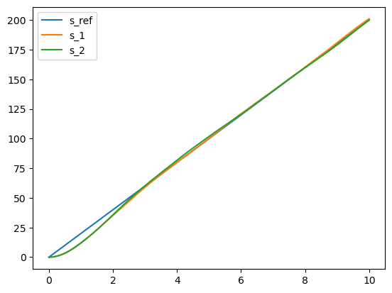
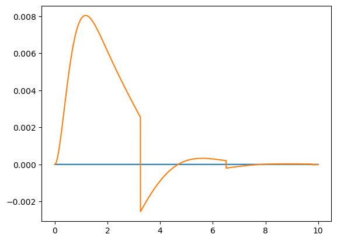

# MINI PROJECT 1

## Part 1

My best guess for parameters:
$$
\rho=1.2250(kg/m^3)\\
C_d = 0.35\\
C_r = 0.01\\
m = 1000(kg)\\
g = 9.8(m/s^2)\\
I_w = \frac{1}{2}m_w\cdot R^2 = 0.5\cdot 15\cdot 0.3^2 = 0.675(kg/m^2)\\
M_t = \frac{(mR^2+I_w)R_g}{R} = \frac{(1000\cdot 0.3^2+0.675)\cdot 3.5}{0.3} = 1057.875(kg/m)
$$

---

## Part 2

### a): Design a linear controller by linearizing the system

#### 1.

Total torque: $T = \frac{T_e}{M_t}-\frac{T_b R_b}{M_t}$

Speed error: $e(t) = \overline{v}-v(t)$

Then, the dynamical system becomes
$$
-\dot{e} = -ae^2+2a\overline{v}e+T-(a\overline{v}^2+c)\\
\dot{e} = ae^2-2a\overline{v}e-T+a\overline{v}^2+c
$$
where
$$
a = \frac{\rho C_d}{2 M_t} = 2.03E-04\\
c = \frac{C_r mg}{M_t} = 0.093
$$

#### 2.

In the neighborhood of the origin, $x^2 = \sum_{n=0}^\infty \frac{f^{(n)} (0)}{n!}(x)^n = 0+0+x^2+0+……$

Thus, the system can be linearized as:
$$
\dot{e} = -2a\overline{v}e-T+(a\overline{v}^2+c)
$$

#### 3.

Distance error: $y(t) = \overline{x}(t)-x(t)$

$$ T=k_1 y+k_2 e + a\overline{v}^2+c $$

#### 4.

Plug in
$$
\begin{align}
\dot{e} &= -2a\overline{v}e-k_1y-k_2e\\
&= -(2a\overline{v}+k_2)e-k_1y
\end{align}
$$
Reformulate ($e = \overline{v}-v$)
$$
\begin{align}
-\dot{v} &= -(2a\overline{v}+k_2)(\overline{v}-v)-k_1y\\
-\dot{v} &= -(2a\overline{v}+k_2)(-v)-k_1y-2a\overline{v}^2-k_2\overline{v}\\
\dot{v} &= -(2a\overline{v}+k_2)v+k_1y+2a\overline{v}^2+k_2\overline{v}
\end{align}
$$

#### 5.

$$
\begin{align}
v[t+1] &= v[t]+[-(2a\overline{v}+k_2)v[t]+k_1(\overline{x}[t]-x[t])+2a\overline{v}^2+k_2\overline{v}]\delta\\
&= v[t]+[-(2a\overline{v}+k_2)v[t]+k_1\overline{v}t-k_1x[t]+2a\overline{v}^2+k_2\overline{v}]\delta\\
&= v[t]+[-(2a\overline{v}+k_2)v[t]-k_1x[t]+2a\overline{v}^2+(k_2+k_1t)\overline{v}]\delta\\
\end{align}
$$

$$
\begin{align}
x[t+1] &= x[t]+v[t]\delta
\end{align}
$$

#### 6.

Take $\sigma = 0.05$, $\mu = 0$ for $w[t]$

### b): Directly design a controller for the nonlinear system

#### 1.

$T=ae^2+k_1 y+k_2 e + a\overline{v}^2+c$

#### 2.

Plug in
$$
\begin{align}
\dot{e} &= -(2a\overline{v}+k_2)e-k_1y
\end{align}
$$
Reformulate
$$
\begin{align}
-\dot{v} &= -(2a\overline{v}+k_2)(\overline{v}-v)-k_1y\\
\dot{v} &= -(2a\overline{v}+k_2)v+k_1y+2a\overline{v}^2+k_2\overline{v}
\end{align}
$$

#### 3.

$$
\begin{align}
v[t+1] &= v[t]+[-(2a\overline{v}+k_2)v[t]+k_1(\overline{x}[t]-x[t])+2a\overline{v}^2+k_2\overline{v}]\delta\\
&= v[t]+[-(2a\overline{v}+k_2)v[t]-k_1x[t]+2a\overline{v}^2+(k_2+k_1t)\overline{v}]\delta\\
\end{align}
$$

$$
\begin{align}
x[t+1] = x[t]+v[t]\delta
\end{align}
$$

#### 4.

Take $\sigma = 0.05$, $\mu = 0$ for $w[t]$

---

## Part 3

### a)

Delta time: $ 0.001s$
Totally 10000 iterations
Choose $\overline{v} = 20m/s$ 
For the two policy, $k_1 = 1.5$, $k_2 = 0.8$



### b)

Use $z[t] = \|s_{ref}[t] - s_{1}[t]\| - \|s_{ref}[t] - s_{2}[t]\|$ (with no noise) to visualize the performance of two controllers:



When $ z[t] > 0 $, it means that that controller 2 behaves better than controller 1 at time $t$

And from $ \frac{\sum_t |s_{ref}[t]-s_1[t]|}{\sum_t |s_{ref}[t]-s_2[t]|} = 1.0010 $, controller 2 is slightly better than controller 1, which means that controller 1, as a linear controller, is already good enough.

---

## Appendix

```python
import matplotlib.pyplot as plt
import random
import numpy as np
```


```python
# some const
a = 2.03*10**(-4)
c = 0.093

# some predetermined para
v_bar = 20
tMax = 10000
tDelta = 0.001
sigma = 0.05

# coeff for controller
k1 = 1.5
k2 = 0.8

```


```python
# generate reference trajectory
x_bar = [v_bar*t*tDelta for t in range(tMax)]
T = [t*tDelta for t in range(tMax)]
```


```python
# policy 1
def policy1 (x_err, v_err):
    return k1*x_err+k1*v_err+a*v_bar**2+c
# policy 2
def policy2 (x_err, v_err):
    return a*v_err**2+k1*x_err+k1*v_err+a*v_bar**2+c
```


```python
# generate trajectory for policy 1
accel1 = [0 for t in range(tMax)]
x1 = [0 for t in range(tMax)]
v1 = [0 for t in range(tMax)]
for t in range(tMax-1):
    accel1[t] = -a*v1[t]**2+policy1((x_bar[t]-x1[t]), (v_bar-v1[t]))-c
    v1[t+1] = v1[t]+accel1[t]*tDelta+random.gauss(0,sigma)
    x1[t+1] = x1[t]+v1[t]*tDelta
    
# generate trajectory for policy 2
accel2 = [0 for t in range(tMax)]
x2 = [0 for t in range(tMax)]
v2 = [0 for t in range(tMax)]
for t in range(tMax-1):
    accel2[t] = -a*v2[t]**2+policy2((x_bar[t]-x2[t]), (v_bar-v2[t]))-c
    v2[t+1] = v2[t]+accel2[t]*tDelta+random.gauss(0,sigma)
    x2[t+1] = x2[t]+v2[t]*tDelta  
```


```python
plt.plot(T, x_bar)
plt.plot(T,x1)
plt.plot(T,x2)
plt.legend(["s_ref", "s_1","s_2"])
```


    <matplotlib.legend.Legend at 0x7fa60b770c70>


​    

​    


```python
# regenerate trajectory for policy 1 with no noise
accel1 = [0 for t in range(tMax)]
x1 = [0 for t in range(tMax)]
v1 = [0 for t in range(tMax)]
for t in range(tMax-1):
    accel1[t] = -a*v1[t]**2+policy1((x_bar[t]-x1[t]), (v_bar-v1[t]))-c
    v1[t+1] = v1[t]+accel1[t]*tDelta
    x1[t+1] = x1[t]+v1[t]*tDelta
    
# generate trajectory for policy 2 with no noise
accel2 = [0 for t in range(tMax)]
x2 = [0 for t in range(tMax)]
v2 = [0 for t in range(tMax)]
for t in range(tMax-1):
    accel2[t] = -a*v2[t]**2+policy2((x_bar[t]-x2[t]), (v_bar-v2[t]))-c
    v2[t+1] = v2[t]+accel2[t]*tDelta
    x2[t+1] = x2[t]+v2[t]*tDelta  
x1 = np.array(x1)
x2 = np.array(x2)
x_bar = np.array(x_bar)
```


```python
# for policy evaluation
plt.plot(T, [0 for t in range(tMax)])
plt.plot(T, np.absolute(x_bar-x1)-np.absolute(x_bar-x2))
```


    [<matplotlib.lines.Line2D at 0x7fa60b7316a0>]


    


```python
np.sum(np.absolute(x_bar-x1))/np.sum(np.absolute(x_bar-x2))
```


    1.0010031571576983
